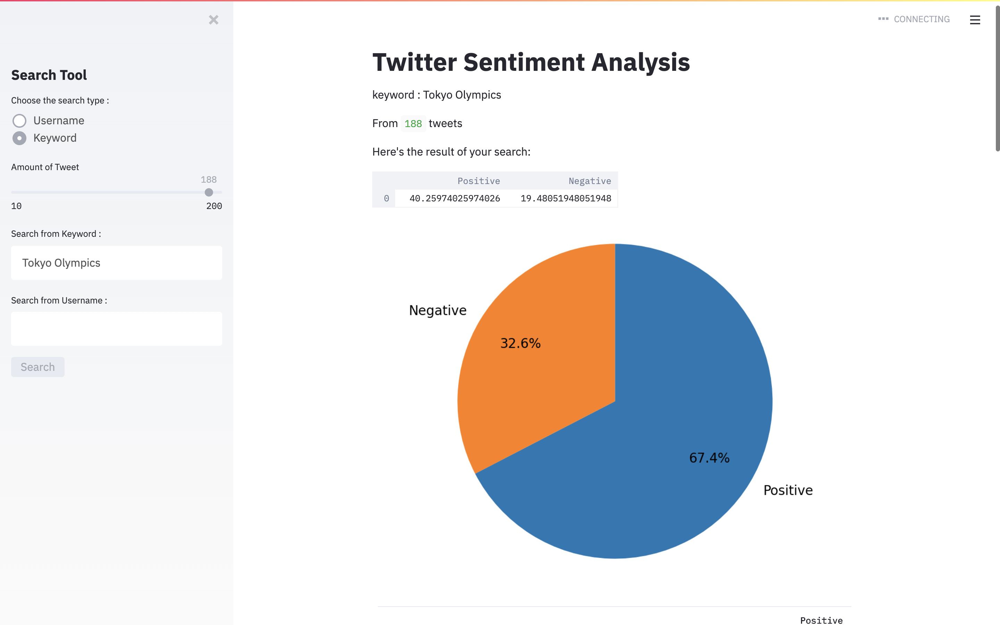

# Twitter Sentiment Analysis

## Introduction:
"This was created during my time as a student at Code Chrysalis."

Project to analyse and visualize sentiment of tweets using twitter API by a username or keyword you want to search for.



## Installation:

1. To get started, clone the repo to a local directory.
```bash
git clone repo link 
```
2. Use the package manager [pip](https://pip.pypa.io/en/stable/) to install the libraries:
- Python3
- Tweepy
- Textblob
- Streamlit
- matplotlib


## Usage:

```python
streamlit run twitterScrape.py
```

## Enjoy!


